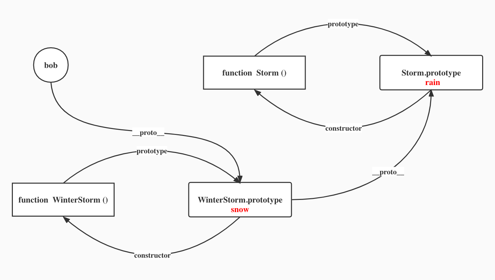
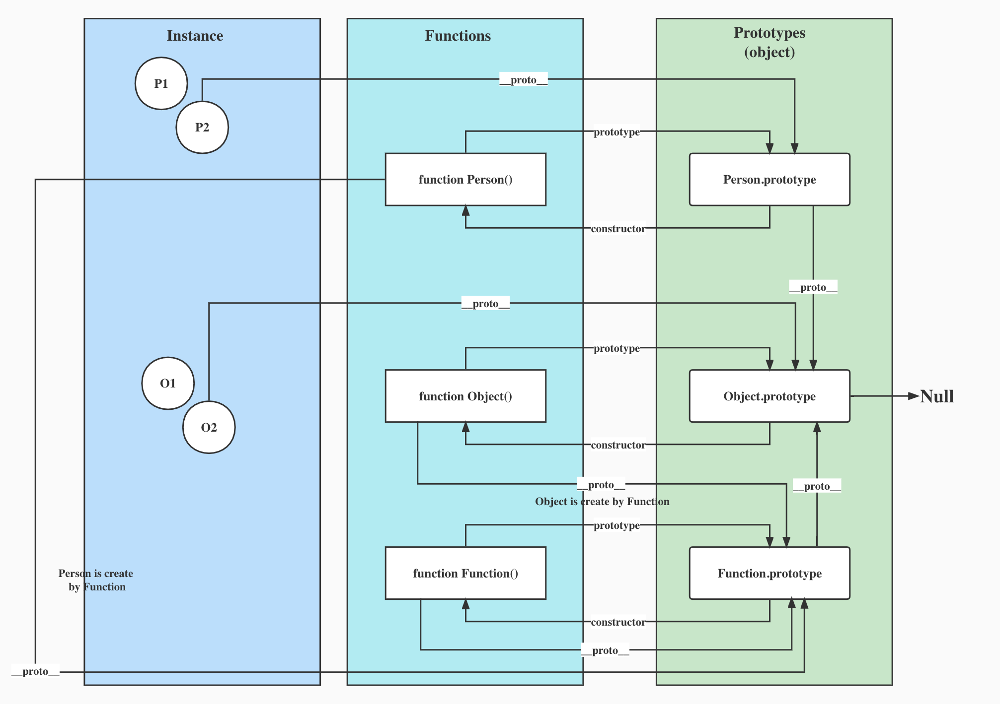

## What is the result in the console of running the code shown?
```js
var Storm = function () {};
Storm.prototype.precip = 'rain';
var WinterStorm = function () {};
WinterStorm.prototype = new Storm();
WinterStorm.prototype.precip = 'snow';
var bob = new WinterStorm();
console.log(bob.precip);
```
```
snow
```

   
## The relationship between **protytype** and **\_\_proto__**.

#### Both prototype and \_\_proto__ point to the prototype object. Any function (including the constructor) has a prototype property that points to the prototype object of that function; any object instantiated by the constructor has a \_\_proto__ property that points to the prototype object of the constructor.
```js
let Person = function () {};
// Cannot use arrow function to define constructor.
let p1 = new Person();
console.log(Person.prototype == p1.__proto__);
```
```
true
```
## The difference between **protytype** and **\_\_proto__**.
1. prototype property is unique to functions, while \_\_proto__ is owned by every object (including functions)
2. The role of prototype objects is to save the public properties and methods shared with all instances; when accessing the properties of an object, if there is no internal properties, it could be in its \_\_proto__ property. Thus the role of the \_\_proto__ is to refers to the parent object to find the parent object, if the parent object don't have the property too, and then go to the parent object of the parent object to find, until null, that is, the prototype chain.

## The relationship between instances, constructors, prototype (objects and property) and \_\_proto__.


1. **Instances**: An object (function is also an object) created by a constructor with the new keyword, we call the object an instance of its constructor
2. **Constructors**: A special kind of function that creates the initialization of a new object, usually with initial capitalization.
3. **Prototype objects**: The object pointed to by the prototype property of the constructor is the prototype object.
4. **Prototype property**: it is unique to functions. Each function has a prototype property, which is a pointer to an object that contains the properties and methods shared by all instances.
5. **\_\_proto__**: The property (two short bars on the left and right of the proto), which points to the prototype object corresponding to the instance object.